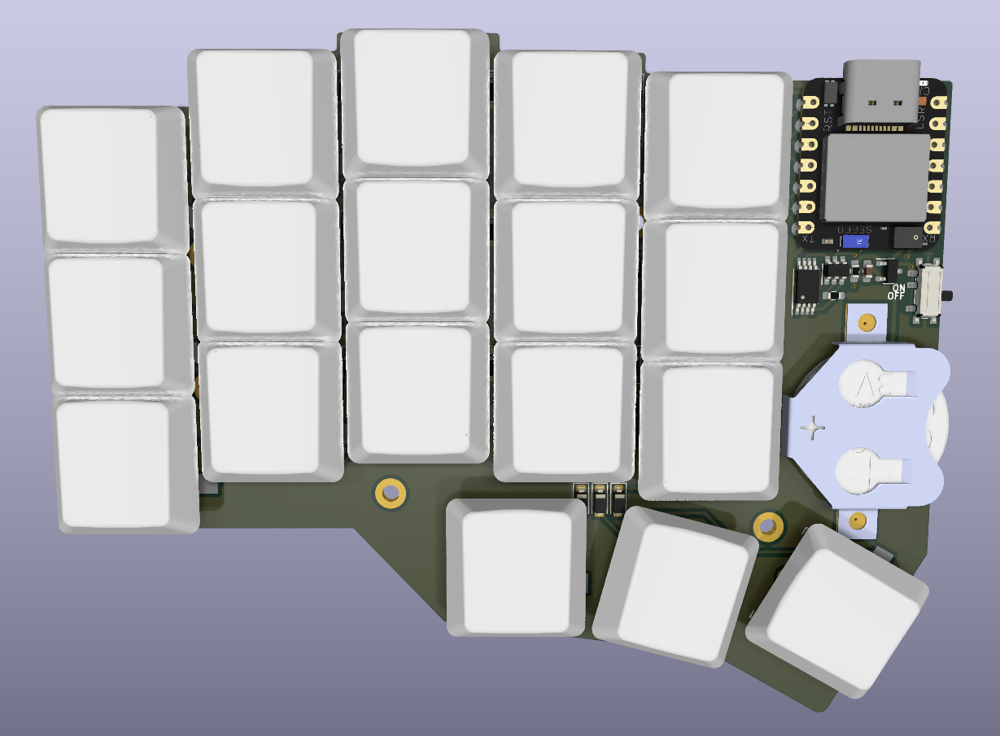

# Choc-spaced Corne keyboard with XIAO BLE and LIR2032
* Gerbers: [Gerbers](https://github.com/tufourn/corne-choc-xiao/blob/hotswap/corne-hotswap.zip?raw=true)
* Interactive bill of materials: [iBOM](https://htmlpreview.github.io/?https://github.com/tufourn/corne-choc-xiao/blob/hotswap/bom/ibom.html)

## PCB

A choc-spaced Corne PCB modified to support LIR2032 batteries and XIAO BLE microcontroller.

Supports optional hotswap sockets.

Ordering from [JLCPCB](https://www.jlcpcb.com) will cost about $8 + shipping.

## Bill of materials

| Name | Qty | Package | Value | Description |
| ---- | --- | ------- | ----- |------------ |
| U1   | 1   | SMD     | MCU   | XIAO BLE    |
| U2   | 1   | SOT-23-6| DW01A |Battery protection IC |
| U3   | 1   | TSSOP-8 | FS8205A | Dual N-Channel MOSFET |
| C1   | 1   | 0603    | 100n | SMD Capacitor |
| R1   | 1   | 0603    | 100R | SMD Resistor |
| R2   | 1   | 0603    | 1k   | SMD Resistor |
| Q1   | 1   | SOT-23  | SI2302 | N-channel MOSFET for reverse polarity protection |
| S1   | 1   | SMD     | SPDT | 7 pin SMD SPDT Switch |
| BT1  | 1   | SMD     | LIR2032 | LIR2032 Battery Retainer |
| D1-36| 36  | SOT-123 | 1n4148 | Diodes for keyboard matrix |
| SW1-36 | 36| THT     | PG1350 | Kailh Choc Switches |

